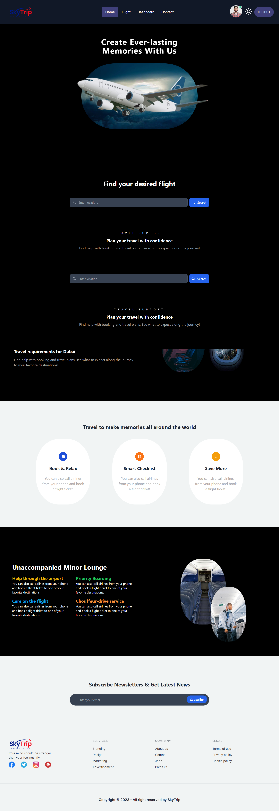
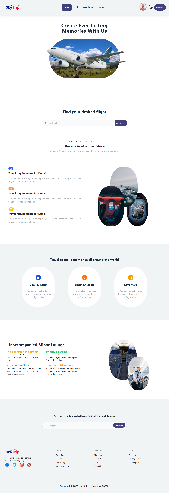
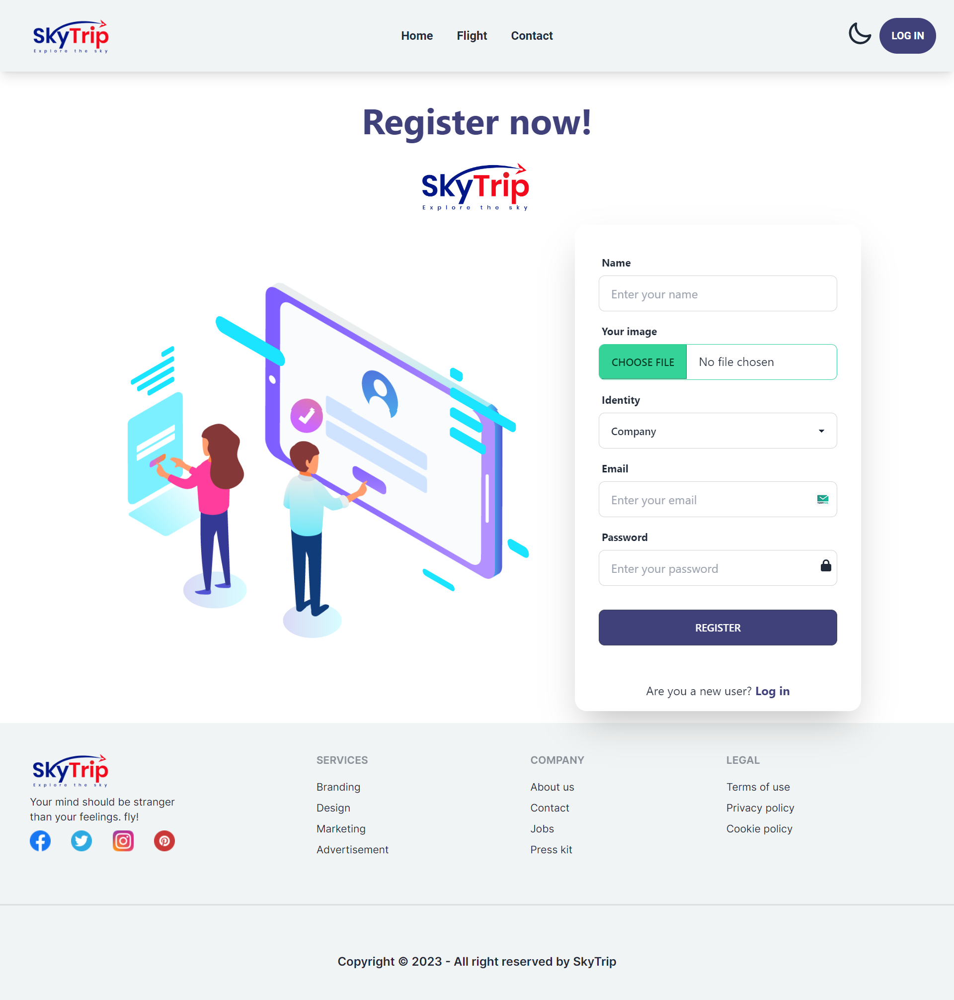
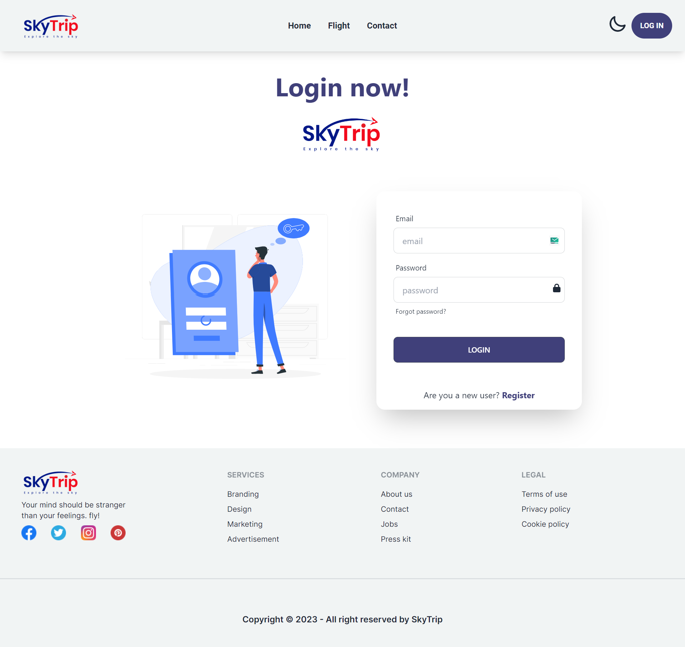
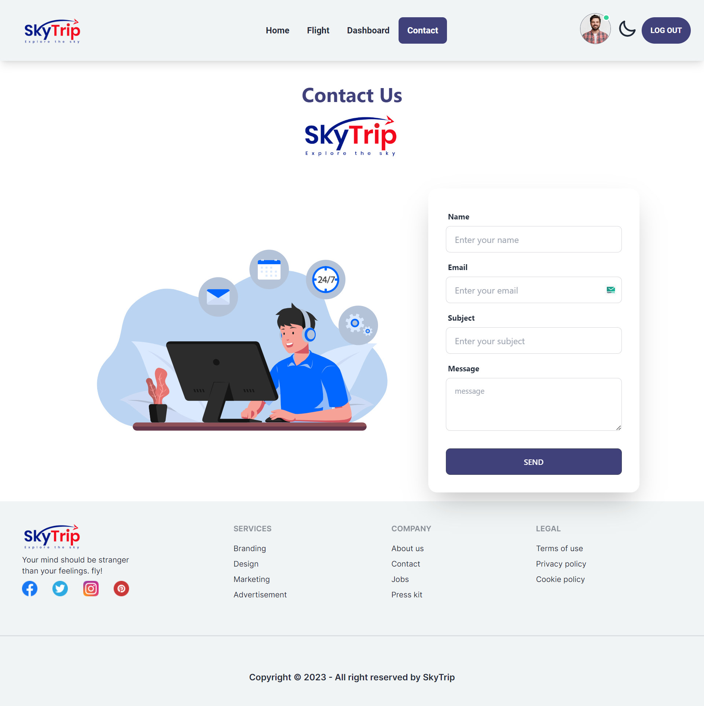
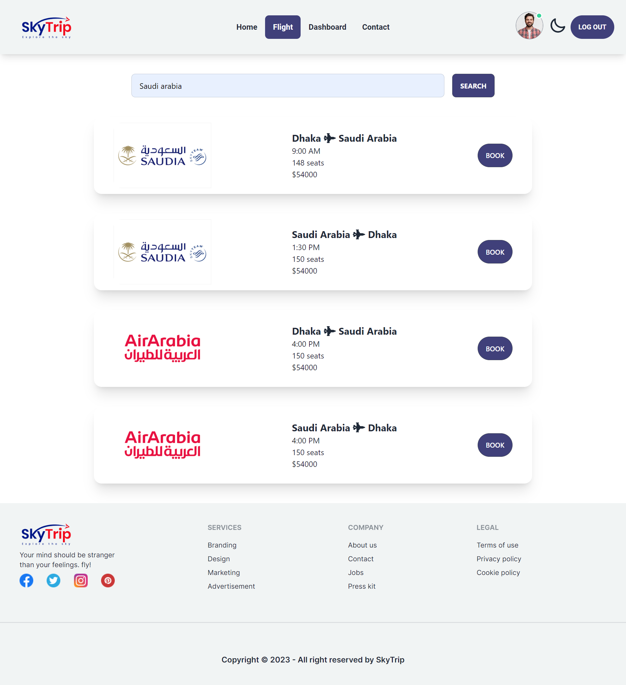
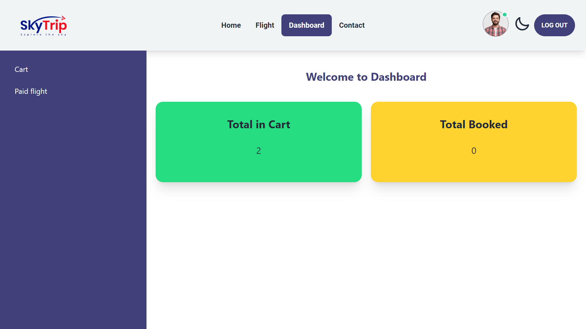
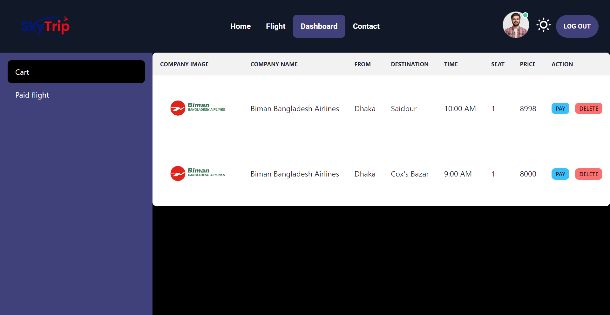
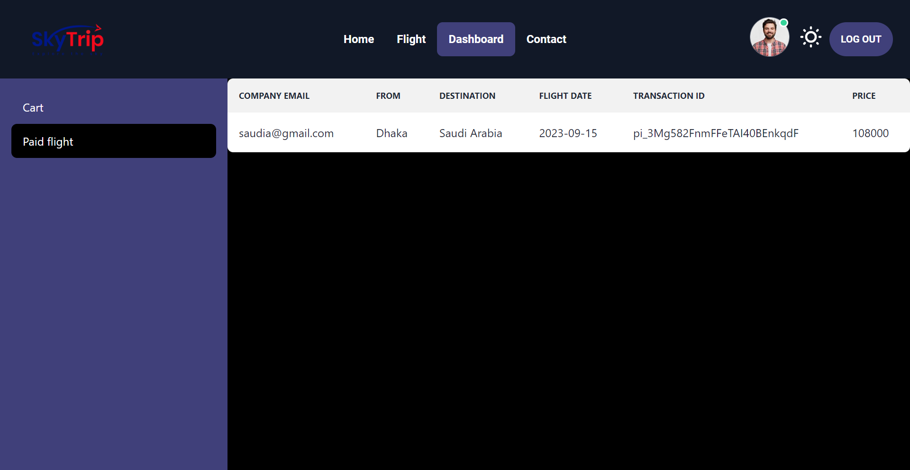

# Sky-trip

Sky-trip is a website of booking flight tickets.

### Live website link: [https://sky-trip-8a062.web.app)

## Features

- Light/dark mode toggle
- The user can -
    - book and cancel flight tickets
    - track his/her booking tickets.
- The company can -
    - add flight info.
    - delete flight info.

- User can contact with us
- Lottie animation is used
- Secure sensitive data
- Password hide and show functionality
- From validation
- Fully responsive
- Fullscreen mode
- Cross platform

## Screenshots

## To see more, please visit the website. Thank you :)

## Tech Stack

**Client:** TailwindCSS, ES6, JavaScript, DaisyUi, React, TanStackQuery, React-FontAwesome, Lottie, EmailJS, React-hook-form, Stripe, React-router, React-hot-toast, JWT, AOS

**Server:** Node, Express, Firebase, MongoDB, ImageBB

## Admin 
Email: abdurrahman@gmail.com

password: 123456